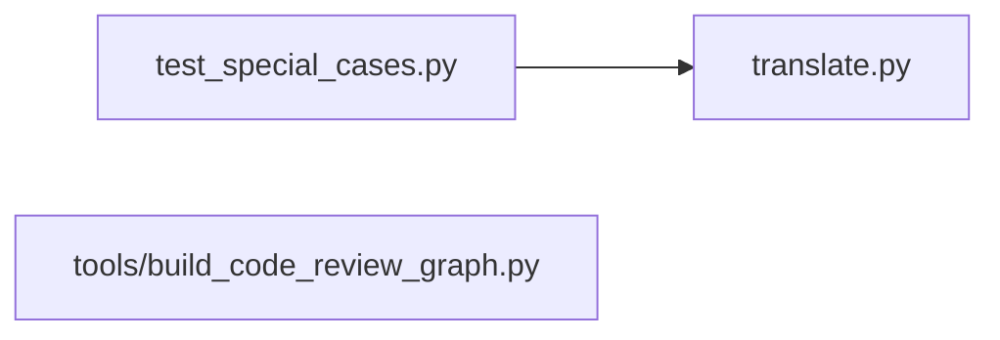
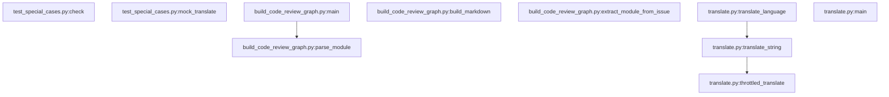
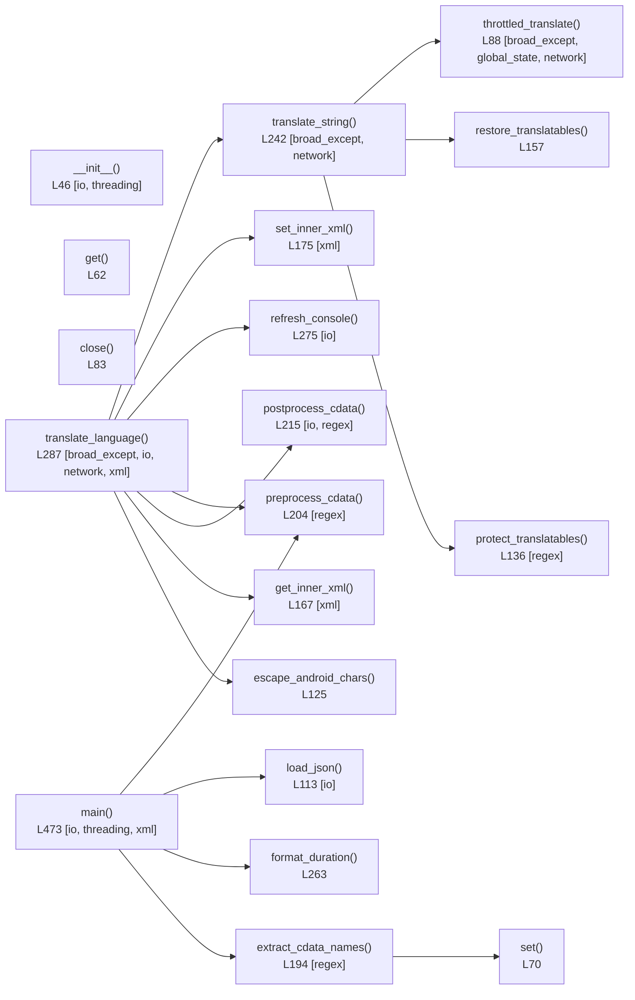

# Code Review Graph

Artifact này được sinh tự động từ mã Python trong repo để hỗ trợ review nhanh theo dependency, call flow và hotspot rủi ro.

## File Dependency Graph

## Function Call Graph

## Detailed Function Graph: translate.py

## Review Hotspots

| Module | Score | Tags | Notes |
| --- | ---: | --- | --- |
| `translate.py` | 22 | broad_except, global_state, io, network, regex, threading, xml | entrypoint, 591 lines, concurrency, external API |
| `tools/build_code_review_graph.py` | 11 | io, regex | entrypoint, 580 lines |
| `test_special_cases.py` | 3 | - | 272 lines |

## Function Hotspots

| Function | Score | Tags |
| --- | ---: | --- |
| `translate.py:translate_language()` @ L287 | 18 | broad_except, io, network, xml |
| `translate.py:main()` @ L473 | 13 | io, threading, xml |
| `translate.py:throttled_translate()` @ L88 | 8 | broad_except, global_state, network |
| `translate.py:translate_string()` @ L242 | 6 | broad_except, network |
| `build_code_review_graph.py:parse_module()` @ L138 | 5 | io |
| `build_code_review_graph.py:main()` @ L555 | 5 | io |
| `translate.py:__init__()` @ L46 | 5 | io, threading |
| `build_code_review_graph.py:build_markdown()` @ L448 | 4 | - |
| `translate.py:postprocess_cdata()` @ L215 | 4 | io, regex |
| `build_code_review_graph.py:extract_module_from_issue()` @ L192 | 3 | regex |
| `build_code_review_graph.py:build_impact_report()` @ L230 | 3 | - |
| `build_code_review_graph.py:build_mermaid_function_graph()` @ L360 | 3 | - |

## Review Order

1. `translate.py:translate_language()` vì đây là luồng chính, có I/O, XML transform, cache và concurrency.
2. `translate.py:throttled_translate()` vì đụng API ngoài, retry và global rate limit.
3. `translate.py:translate_string()` vì là lớp bảo toàn placeholder/HTML trước khi gọi dịch.
4. `translate.py:postprocess_cdata()` vì sửa nội dung XML sau khi serialize, dễ gây hỏng output.
5. `test_special_cases.py` để kiểm tra coverage hiện tại và khoảng trống test.

## Coverage Gaps Suggested For Review

- Chưa thấy test race condition quanh `_last_call_time`, `TranslationCache.lock` và `thread_status`.
- Chưa thấy test end-to-end cho `main()` với file đích đã tồn tại và dữ liệu bị lệch schema.
- Chưa thấy validation cho trường hợp parse XML lỗi ở file nguồn hoặc file đích.
